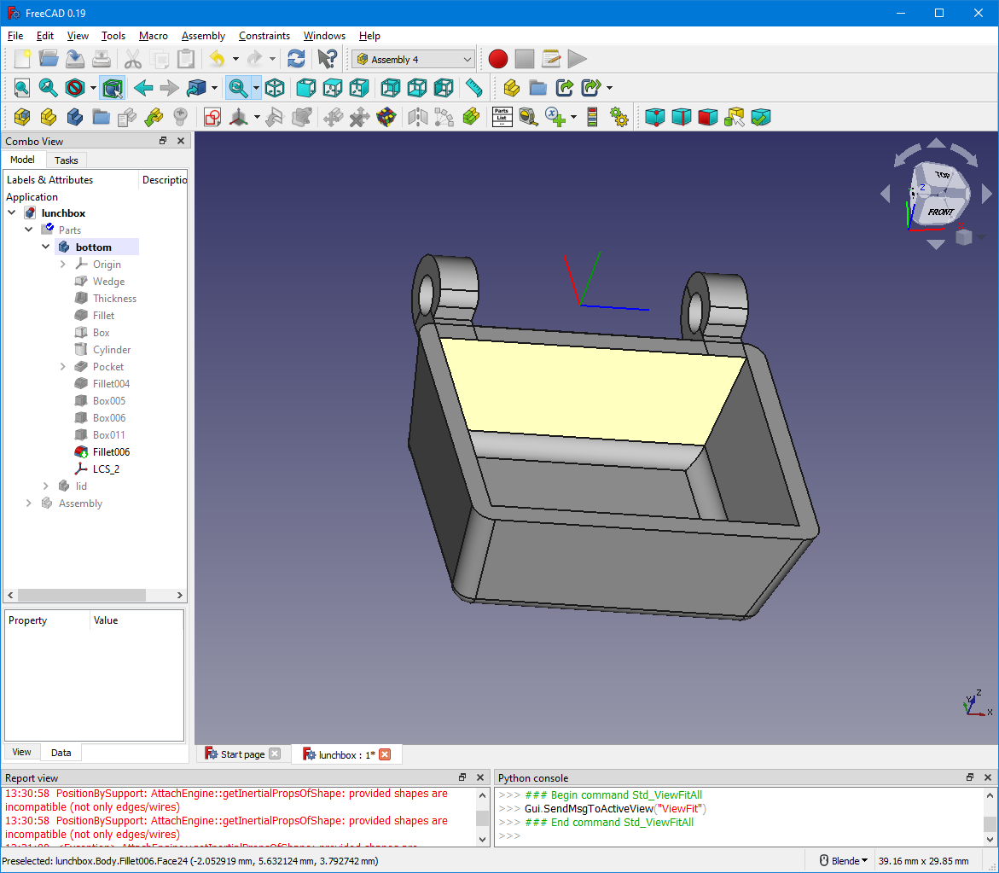
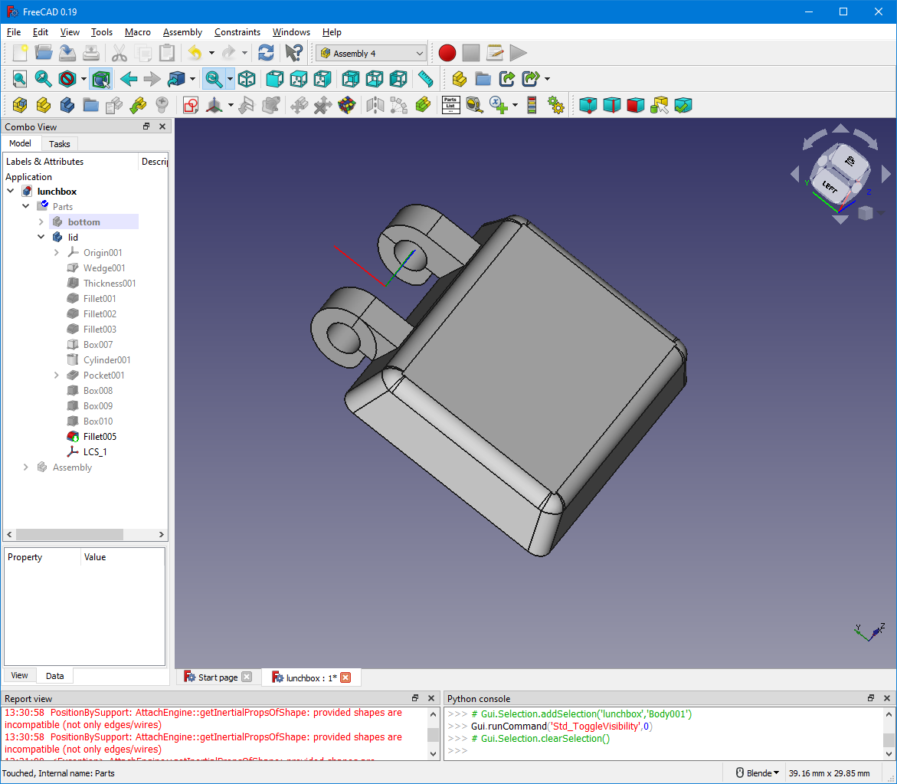
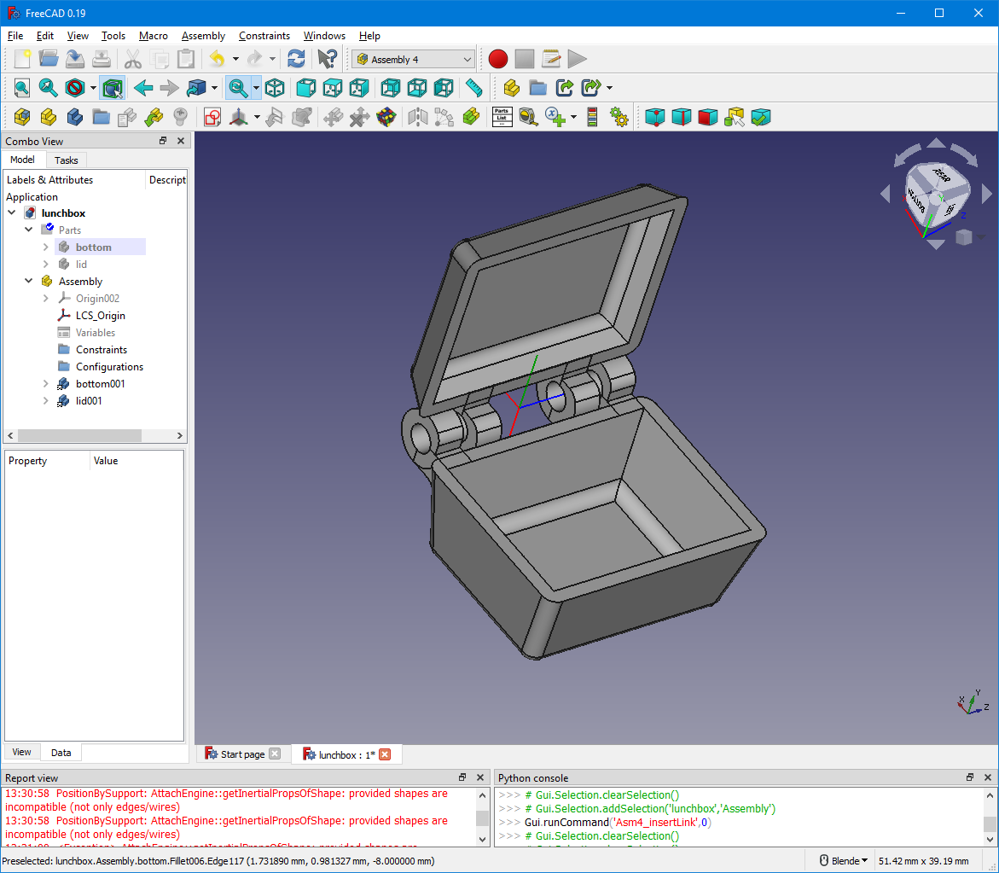
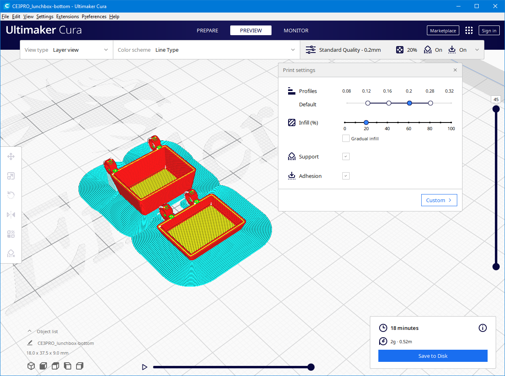

# Tiny Lunchbox

I finally started playing with a Creality Ender3 Pro 3D printer that I bought more than 2 years
ago on Woot! for a ridiculously low price of $160 as part of a Black Friday sale.

I also picked up FreeCAD... again... after 3 failed attempts in the past 4 years. Many hours
of Youtube videos later, I finally think I'm starting to get it.

My daughter asked me to create a keychain-sized lunchbox which was the perfect excuse I needed
to design my first 3D printed item from scratch.

This is the result: a bottom and a lid, held together with hinges and tiny nuts and bolts.

It's not perfect, neither is the printer itself, and my calibration is probably even worse, but
it's a good start. I'm happy with it, and I'm ready to try more ambitious projects.

I used Cura as slicer. For reasons unknown, PrusaSlicer gave me tons of problems...

